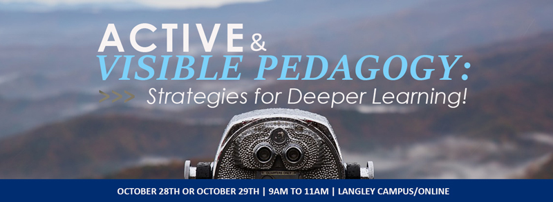

**Subject:** TOnE Session: for Active and Visible Pedagogy: Strategies for
Deeper Learning

 

 

 

Please join our GLOBAL Online team *October 28th OR October 29th*  9am-11am for
our next TOnE Session:  **Active and Visible Pedagogy: Strategies for Deeper
Learning!**

 

In this 2 hour session, we'll explore some key ideas in designing effective
activities and assessments for your course.  We ask faculty to bring a ‘*Wow!* ‘
and a ‘*Wonder?’*  from your teaching practice – something that's worked well to
engage your learners, and something you wonder about.  Our focus will be on
small group activities to give you the chance to explore and question engagement
strategies that are meaningful to you.

 

*Please consider joining us on campus or online!*

 

*To register, please use the following link:* <https://tally.so/r/3lRrvn>

Campus Location: Glass Room, Norma Marion Alloway Library

We are offering the same session on both days, so choose the day time that works
for you *October 28th OR October 29th*  9am-11am

Attend in person or via Zoom:

Online: [Zoom
link](https://twu.zoom.us/j/98778529682?pwd=dmQ5SEdqa3J3NmoyRTFJcGVacEVQZz09)

 

*GLOBAL Online Team*
