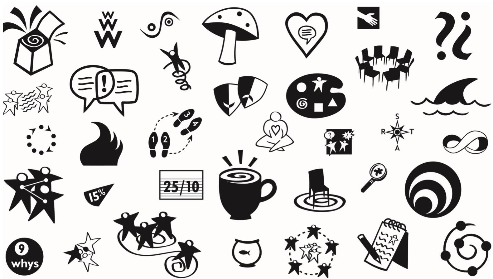
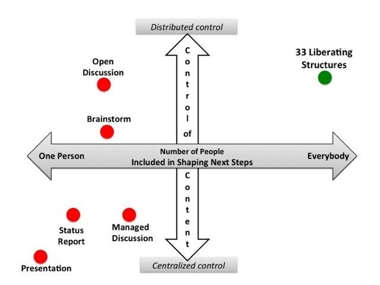
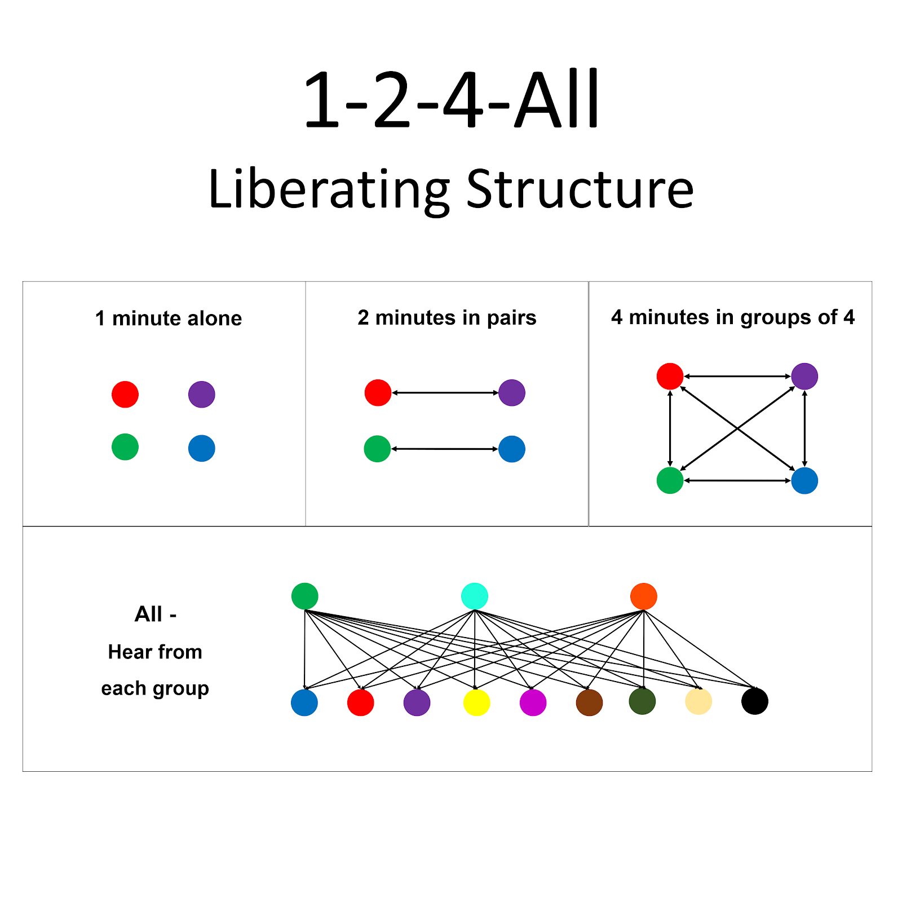

## Using Liberating Structures to Create and Sustain Communities of Inquiry

## One Another Relationships & Collaborative Community Building

One insight into community building in the early church comes from 1 Corinthians 12:24-26:

*“God has put the body together...so that there should be no division in the body, but that its parts should have equal concern for each other. ****If one part suffers, every part suffers with it; if one part is honoured, every part rejoices with it.”*

In the first century church, everyone was engaged. Everyone had equal responsibility to care for each other. Everyone was aware of what was alive meant in the community - the victories and the hardships. There are over 60 New Testament passage with the phrase “one another” (Greek *ἀλλήλων*) which serve as a community building roadmap.

One question for us educators is, “How can the modern classroom or learning space capture a little of this one-another community approach? How can we as facilitators and instructors structure activities in such a way that it encourages everyone to engage in collaborative, compassionate learning and insightful connection?

## Changing the Paradigm

One way to start answering this question is to take its opposite to the extreme. How can we completely guarantee we have disengaged students with “bodies present but minds absent” (McCandless & Lipmanowicz 2014). Here are a few options:

:fa-check: Use lots of PowerPoints and default to lecture 90% of the time (Presentation mode)  
:fa-check: Save any engagement until the last few minutes, ask if anyone has any questions and wait for the most extroverted students to respond (Open Discussion).  
:fa-check: Leave any brainstorm discussion open ended with no expectation of participation, time limits or processing time before discussion (The brainstorm).  
:fa-check: Put maximum control of content in the hands of one or few people.  
:fa-check: Only engage a small number of participants in actual discussion.  

The next thought exercise is to consider if anything on this list is something you are actually doing right now, whether to a greater or lesser extent. What could you stop doing to make space for more engagement?

That awareness and “noticing” is crucial to moving out of set patterns and habits of conventional ways of facilitating and moving towards more engaging methods. “The range of what we think and do is limited by what we fail to notice” (Laing, 1970, p. 56). It’s when we start noticing how we limit and constrain engagement through our own decisions, conscious or otherwise,  that we can start moving towards more intentional forms of community building.

## Centralized vs Distributed Control

My experience in facilitating and teaching was that I had to go through a bit of a paradigm shift, a transformation in my thinking and a “get-the-beam-out-of-my-own-eye” moment to realize that the way I was teaching was counterproductive. Out of fear of losing control, I would drive my lessons to the slide deck, and limit conversation out of fear of what may emerge - opening a Pandora’s box that I couldn’t shut again.

That fear and desire for control I finally realized was limiting group insights, connections and Eureka moments from happening. That realization came when I was first introduced to Liberating Structures, a growing set of facilitation tools meant to be “simple rules to engage everyone in productively moving forward”.

Keith McCandless and Henri Lipmanowicz posit that engagements happen along a continuum from centralized to distributed control, and from having one person to everyone actively and fully engaged (see diagram).

In this diagram, conventional microstructures (presentation, managed and open discussions, status reports, etc) “perpetuate long running traditions” and limits fully engaged participation. Instead we fall into the trap of resorting to these “tried-and-true” methods of engagement while failing to notice what is really happening in the room and how our unconscious decisions directly impact the level of engagement in the room (McCandless & Lipmanowicz, 2014, p. 20).

On the other side of the spectrum are techniques for structured group facilitation, Liberating Structures being a toolbox of examples, which strive for “full engagement” where “everybody plays an active and unrestrained role in contributing ideas, discussing options and shaping next steps.” (2014, p. 19).

*Tips for Teaching: Ask yourself, “How am I distributing control in the engagement process? Where am I providing agency for my students? Who is engaged? What is alive in the room?*

## What’s Alive in the (Zoom) Room?

Part of what drew me to Liberating Structures is empathizing with my fellow introverts: the reluctance to be the first to speak up in class, the need to process information quietly on my own before launching into conversation, the need to feel safe in smaller conversational settings.

This explains that awkward silence when instructors ask the proverbial question, “Does anyone have any questions?” followed by a deadly silence. The common conclusion may be that no one had any questions, which is more a projection than anything. There are so many reasons why people won’t speak up in that open discussion setting: feeling unsafe, waiting for others to step up, need for processing time to articulate thoughts in a safe environment.

What happens inevitably is that the instructor gets uncomfortable with the silence and quickly moves on, leaving behind a microcosm of unique thought patterns, connection making and insight all gone untapped. If only they were curious and asked the question, “What’s really alive in the room?” and then went about unleashing an opportunity for everyone for everyone to engage.

## Rich Dialogue with 1-2-4-All!

Here is where the importance of structured group facilitation comes in, and Liberating Structures has a great set of tools for this. Take for example the structure called 1-2-4-All (you may know a similar pattern of Think-Pair-Share):

1. Allow everyone to spend 1 minute alone in mindful silence, writing, thinking, drawing or whatever they need to gather their thoughts (this step will have all the introverts in the room loving you).
2. Then have everyone spend 2 minutes in pairs (Zoom equivalent: breakout rooms of two with a timer) 1 minute each, to discuss your “invitation” (the question you want them to ponder).
3. Next gather students into groups of 4 (Zoom: allow students to choose rooms and pairs find another pair - or randomize to 4) and have them come up with salient points, commonalities and something amazing they’re dying to share back with the whole class
4. In the final stage, “All”, gather those discussions as an unbiased facilitator, allowing groups to share back with the whole class what insights they gathered.

The diagram below shows what happens from an interaction point of view within the 1-2-4-All activity. All you have to do is count the number of lines between the dots to see how rich the engagement opportunity is with this structured activity, allowing everyone to participate. The depth of thinking that emerges is surprisingly rich!

## Democratizing & decolonizing the classroom

This process -- intentionally and by design -- of including everyone in shaping what emerges, introduces a democratizing of the classroom.  The untapped knowledge in the room can be formed or discovered with the principle that everyone in the room brings value to the discussion. That is a decolonizing, inclusive path to engagement and community forming that ultimately brings about surprising results.

When we invite courage, embrace transparency and collaborativism, practice appreciative learning, allow for powerful and flexible sharing, and ponder “both/and” thinking, we disrupt the cultural and mindset traps that often hold us back from reaching our full communal potential (Hooper, 2019).

By structuring safe environments for sharing, enabling patterns for rich dialogue and mindful interactions, facilitators can open up opportunities for students to learn how to learn together, gather value insights, make connections, and as a result build a stronger community.

## Attributes and Micro-Organizing Design Elements of Liberating Structures

Some of the many attributes of Liberating Structures are that they are:

1. Expert-less: Good news - you don’t need a certificate to facilitate these. They require only a few minutes to introduce and novices can succeed after a first experience.
2. Results-focused: Likely to generate better-than-expected purposeful results
3. Rapid cycling: fast iterative rounds are very productive
4. Seriously fun: boosts joy, freedom & responsibility
5. Inclusive: together, everyone is invited to shape next steps
6. Multi-scale: works for everyday solutions, projects, strategy, movements
7. Self-spreading: simple to copy without formal training
8. Modular: the parts can be combined & recombined endlessly

(From: Liberating Structures website: [liberatingstructures.com](https://liberatingstructures.com/))

There are 5 micro-organizing design elements to every Liberating Structure. In each structures, there will always be the following actions to take:

1. Make an Invitation
2. Distribute Participation
3. Configure Groups (Breakout Rooms)
4. Arrange (Virtual) Space & (Digital) Materials
5. Sequence & Allocate Time

To get a deep dive into what Liberating Structures are and how they enable this type of transformation, please check out this open resource: [Engaging Teams with Liberating Structures.](https://docs.google.com/presentation/u/0/d/1wfR4QGBy4c9PDDClZtWk3Z8leo9vtFy8kYsgJH0LS3k/edit)

## Top 5 Liberating Structures for Classroom Engagement

These are my top favourites I’ve used in the classroom, but there are many more (over 33 in counting) that you can try out (links are to the full activity instructions on the LS website - and yes they are free, open source, Creative Commons non-commercial distribution):

1. [Impromptu Networking.](https://www.liberatingstructures.com/2-impromptu-networking/) Purpose: Rapidly Share Challenges and Expectations, Build New Connections
2. [1-2-4-All](https://www.liberatingstructures.com/1-1-2-4-all/). Purpose: Engage Everyone Simultaneously in Generating Questions, Ideas, and Suggestions
3. [9 Whys](https://www.liberatingstructures.com/3-nine-whys/). Purpose: Make the Purpose of Your Work Together Clear.
4. [Troika Consulting](https://www.liberatingstructures.com/8-troika-consulting/). Purpose: Get Practical and Imaginative Help from Colleagues Immediately
5. [What, So What, Now What?](https://www.liberatingstructures.com/9-what-so-what-now-what-w/) Purpose: Together, Look Back on Progress (or learning) to Date and Decide What Adjustments (or further learning & insights) Are Needed.

These are just a few examples. The important thing is to “fail forward” in trying them out, experimenting, tweaking, practicing and playing with strings of these activities. The more you do them, the better you get at sensing what is alive and wants to emerge from the group.

## Synchronous vs Asynchronous

What can this wonderful, collaborative approach to engaging everyone look like in an online synchronous environment (aka Zoom, Teams or other video conferencing software)?

#### Synchronous LS

- Mostly all LS activities in a series of timed breakout rooms with each group as needed accessing collaborative documents (Google Docs, MS Word 365, etc)
- A combination of main room discussion (e.g. [User Experience Fishbowl](https://www.liberatingstructures.com/18-users-experience-fishbowl/)) and chat participation ([Mad Tea](https://www.liberatingstructures.com/mad-tea) is great for this).

#### Asynchronous LS

- Allow students to self-form groups, timing, logistics leveraging technologies like collaborative documents and scheduling tools (Doodle, Calendly).
- Students find their own time to meet and complete a structured activity in their synchronous time.
- If due to time zone issues, it could be fully asynchronous through use of discussion forums, chat or texting platforms (Whatsapp, FB Messenger), but with firm parameters around response times and equal level of interaction by all members that could have some form of accountability metrics via user activity analytics (this brings us into an emerging field of learning analytics and learning engineering, but we won’t go there today)

!!! ### Learning Activity: Your 15% Solution
!!!As a final reflection, take a moment to reflect on your takeaways from this article. “What is your 15 percent? Where do you have discretion and freedom to act? What can you do without more resources or authority to move one step forward in any of the following areas:
!!!
!!! :fa-check: Engaging every one of your students in articulating their grapes of the learning  
!!! :fa-check: In helping provide a one-another communal space for listening and gathering insight  
!!! :fa-check: In disrupting old and out-dated ways to controlling dialogue and participation  
!!! :fa-check: In decolonizing and democratizing the untapped resources in the room  

Anything else? What is possible now? What is emerging? What would happen if everyone was fully engaged?

### References

Begay, Jade. “Decolonizing Community Care in Response to COVID-19”. 2020. Available at: [https://ndncollective.org/indigenizing-and-decolonizing-community-care-in-response-to-covid-19/](https://ndncollective.org/indigenizing-and-decolonizing-community-care-in-response-to-covid-19/)

Christiaan Verwijs, “How to use Troika Consulting Virtually.” (2020). Available at: [https://medium.com/the-liberators/how-to-use-troika-consulting-virtually-e3ec272ba218](https://medium.com/the-liberators/how-to-use-troika-consulting-virtually-e3ec272ba218)

Hooper, Lydia. “*Using data storytelling to disrupt white supremacy culture”. (2019). Available at: http://lydiahooper.com/blog/white-supremacy*

Laing, R.D. *Knots*. (1970). London: Penguin

McCandless, K., and H. Lipmanowicz. "The surprising power of liberating structures." (2014).
