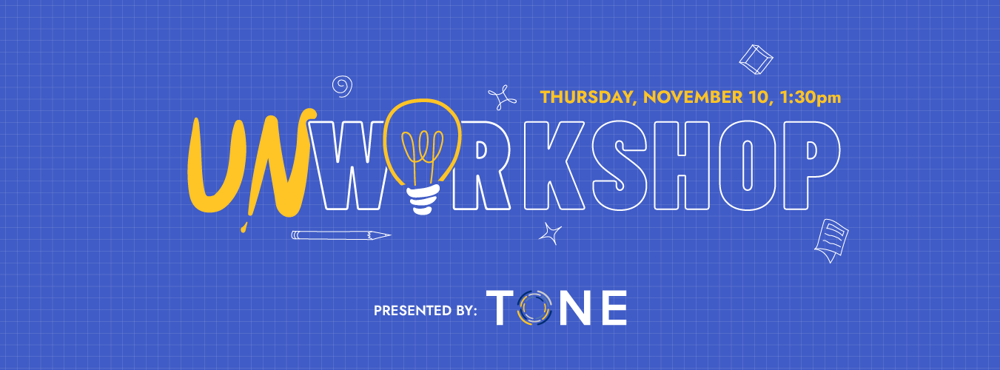

## TONE 2022 - Unworkshop

! Date: November 10  1:30pm
! **Campus Location**: Alumni Hall  
! **Zoom**: See email invitation for the Zoom link

Hello TWU faculty and staff!

We would like to invite you to participate in a TWU UnWorkshop, a professional learning opportunity where you get to drive the agenda and have the flexibility to customize your experience!

To get started, [please visit the UnWorkshop collaborative planning document here](https://oet.sandcats.io/shared/yHZUq-XVaSZndYFtq_Tcv9g-5nkrsMspskpy-E4EyHs) and let us know what you would like to discuss.
