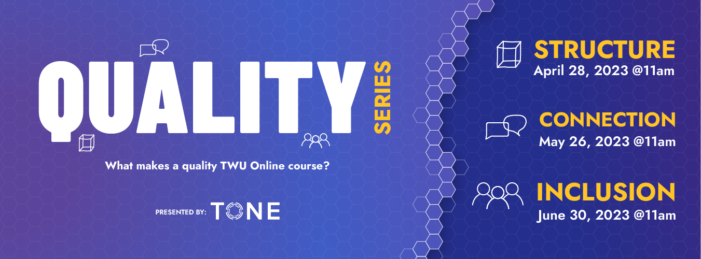

## TONE QUALITY SERIES

Welcome to Teaching Online Effectively 2023!  In the coming months our online team will offer a 3-part series answering this key question: ***“What makes a quality TWU Online course?”***  We want to hear from you as instructors about your experiences teaching OL courses and share best practices in course design.  The series will focus first on the structure of building an online course, next on the strategies for making connections and community online, and finally addressing ways to promote inclusion and accessibility in your courses.

Please see the dates below and save the dates!  

### STRUCTURE - Building Your Online Course

! Date: April 28, 2023 @ 11:00am 

Thank you to all who joined our session!  Here is the recording, as well as some key links to our TWU OL Course Template.

<iframe src="https://player.vimeo.com/video/822796633?h=b2bacd6142&amp;badge=0&amp;autopause=0&amp;player_id=0&amp;app_id=58479" width="600" height="338" frameborder="0" allow="autoplay; fullscreen; picture-in-picture" allowfullscreen title="TONE 04.28.2023: Quality Series - Structure"></iframe>

- [TWU OL Course Template](https://learn.twu.ca/course/view.php?id=23624&section=0#tabs-tree-start) (Enrolment key: TWUOL) *note that the enrolment key is case sensitive.
- For the workshop notes, go to Course Notes, [Quality Workshop #1: Building Your Online Course](https://learn.twu.ca/mod/book/view.php?id=882968) for the Moodle Book. 
- Collaborative Notes: [TWU Online Course Quality Checklist & Tips](https://docs.google.com/document/d/1O36WYMLFnjbSGnstodHGLOQ1Ee7NT1wnWnZ8y0uLMSk/edit)
- [Coloring for Colorblindness](https://davidmathlogic.com/colorblind/#%23D81B60-%231E88E5-%23FFC107-%23004D40)

Please join us for our next workshops!
### CONNECTION - Connecting Online

! Date: May 26, 2023 @ 11:00am 
! **Zoom**: See email invitation for the Zoom link

### INCLUSION - Inclusion in Online Courses

! Date: June 30, 2023 @ 11:00am 
! **Zoom**: See email invitation for the Zoom link
